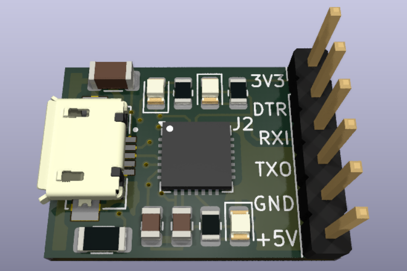
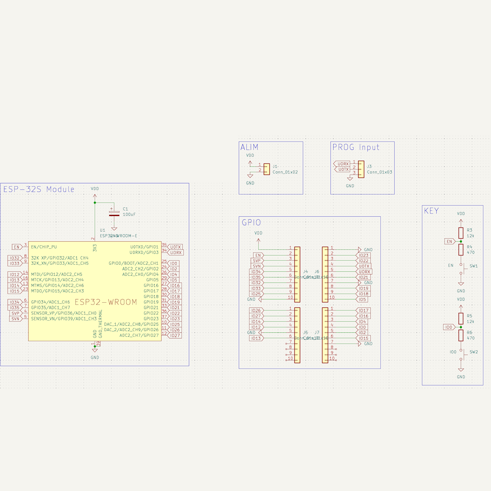
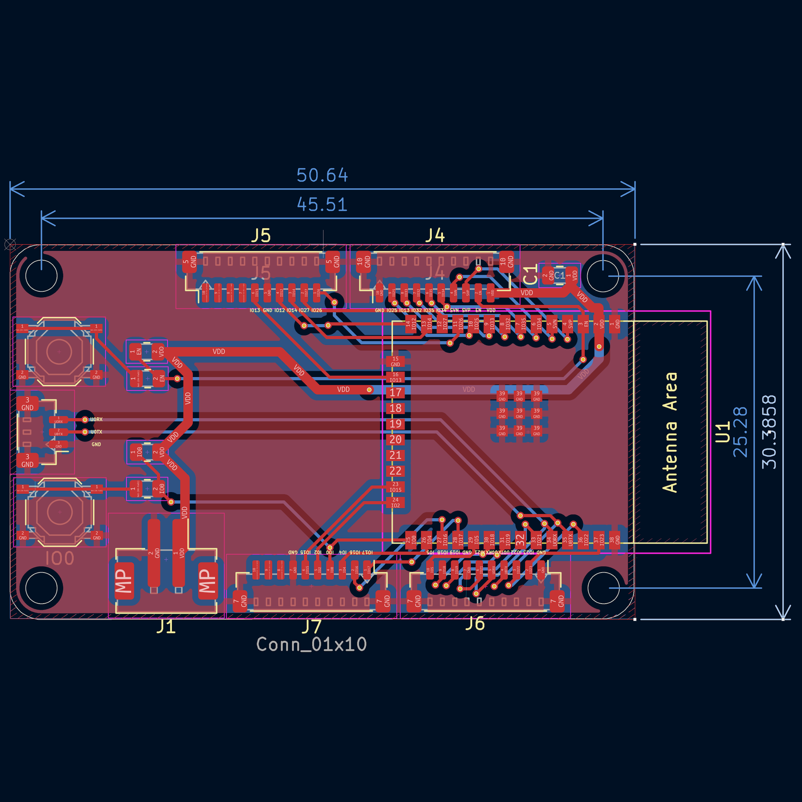
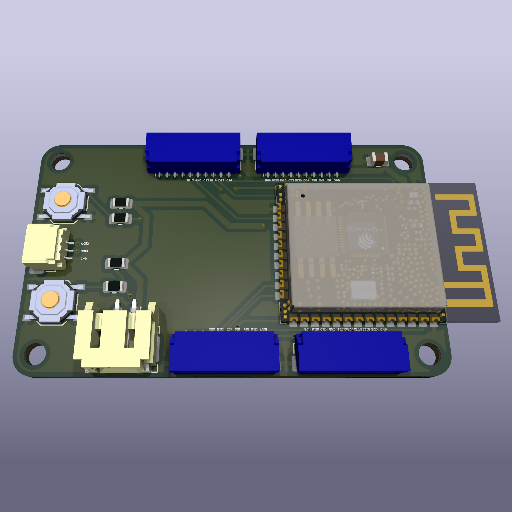

# Esp32InterfacePcb

# UsbUartBridge

## 🚀 Overview

**Esp32InterfacePCB** is an open-source PCB designed to provide a reliable interface between an **Espressif ESP32-WROOM-32E** module and various external modules using **JST-SM & JST-SH connectors**. This PCB simplifies ESP32 integration into embedded, IoT, and home automation projects.

## 🎯 Purpose

- 🔌 **Modular Interface**: Facilitates the connection between an ESP32-WROOM-32E and other peripherals.
- 📏 **Compact & Optimized Design**: Suitable for embedded project constraints.
- 🛠️ **Open-source & Customizable**: Modify and adapt the design to fit your specific needs.

## 📝 Features

| 🏷️ Feature            | 🔍 Description                                                 |
| ---------------------- | -------------------------------------------------------------- |
| 🔌 **ESP32 Interface** | Compatible with the ESP32-WROOM-32E module                     |
| 📡 **Connectors**      | JST-SM & JST-SH for easy connections                           |
| ⚡ **Power Supply**     | Supports 3.3V                                                  |
| 🛠️ **GPIO Access**    | Access to key GPIO pins for seamless integration               |
| 🔧 **Capacitors**      | Decoupling capacitors for signal stability                     |
| 🖥️ **PCB Design**     | Open-source & customizable                                     |
| 🌍 **Use Cases**       | IoT, embedded systems, automation, robotics, rapid prototyping |

## 📐 PCB Design Preview
| 📜 Schematic | 🖥️ PCB Layout | 🏗️ 3D |
|-----------|-----------|-----------|
|  |  |  |

## 🌟 License

This project is open-source. Feel free to use, modify, and contribute! 🚀

